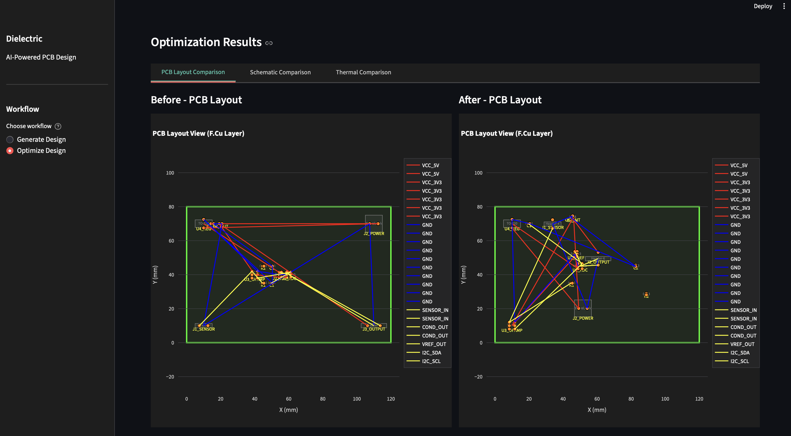
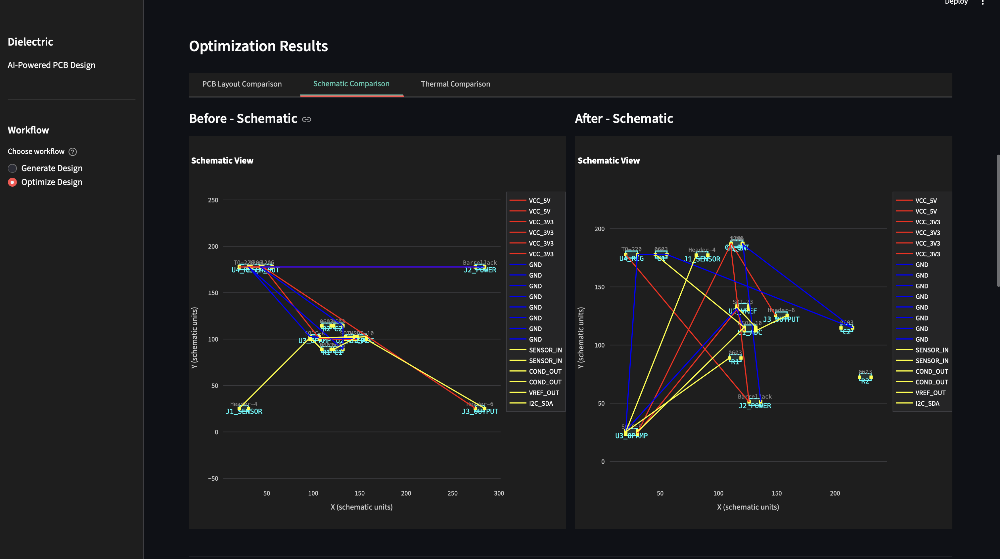
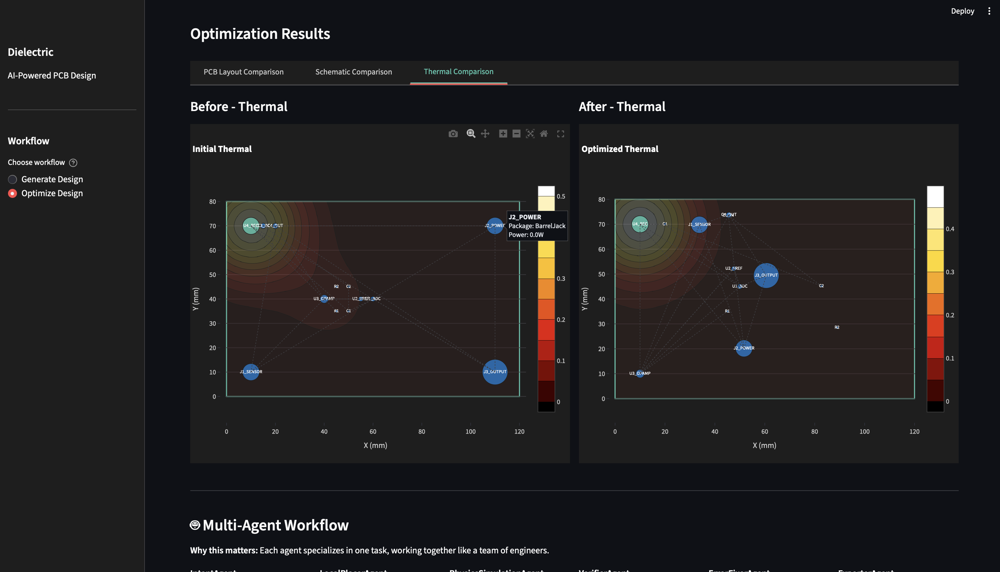
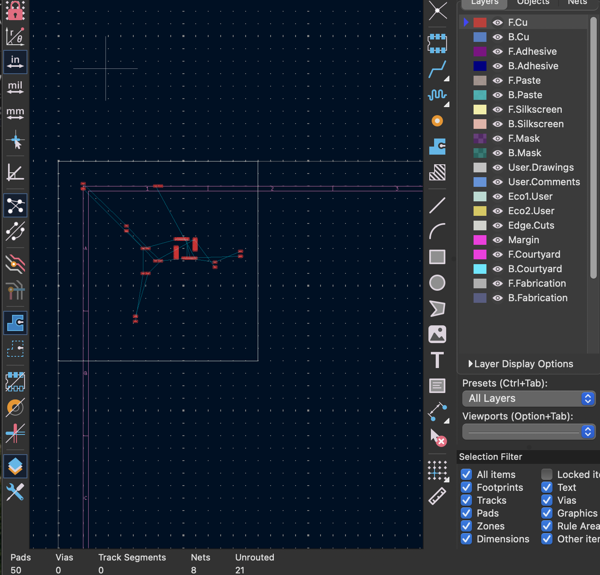

# Dielectric

**Computational Geometry + Multi-Agent AI for PCB Design**

Dielectric is an AI-powered PCB design platform that combines advanced computational geometry algorithms with multi-agent AI reasoning to generate, optimize, and analyze printed circuit board designs from natural language descriptions.

---

## Overview

Dielectric provides tools for PCB design generation, optimization, and analysis. The platform uses computational geometry analysis, simulated annealing optimization, and Grok (xAI) reasoning to support:

- **Generate** complete PCB designs from natural language descriptions
- **Optimize** existing designs using AI-powered algorithms
- **Analyze** designs with computational geometry metrics
- **Export** to industry-standard formats (KiCad, Gerber, etc.)

---

## Key Features

### Natural Language Design Generation

Input a natural language description of your PCB design. The system generates component placement and routing suggestions based on the description.

**Example:**
```
"Design a 2.4GHz RF module with transceiver IC, matching network, antenna, and power management"
```

### Computational Geometry Analysis

The platform implements computational geometry algorithms for PCB layout analysis:

- **Voronoi Diagrams** - Analyze component distribution and thermal hotspots
- **Minimum Spanning Tree (MST)** - Optimize trace routing and minimize wire length
- **Convex Hull Analysis** - Measure board utilization and component spread
- **Delaunay Triangulation** - Identify component neighborhoods and local density
- **Thermal Hotspot Detection** - Gaussian thermal diffusion modeling
- **Net Crossing Analysis** - Detect routing conflicts and complexity
- **Force-Directed Layout Metrics** - Analyze placement equilibrium

### Multi-Agent AI Architecture

The system uses multiple specialized agents:

- **IntentAgent** - Understands user goals using computational geometry + xAI
- **DesignGeneratorAgent** - Creates designs from natural language
- **LocalPlacerAgent** - Optimizes component placement (deterministic, fast)
- **GlobalOptimizerAgent** - Applies research-backed global optimization algorithms
- **VerifierAgent** - Validates design rules and constraints
- **ErrorFixerAgent** - Automatically fixes violations
- **RoutingAgent** - Handles trace routing and differential pairs
- **ManufacturingAgent** - Generates Gerber, drill, and pick-place files

### Comprehensive Design Analysis

Compare designs before and after optimization with:

- **PCB Layout Comparison** - Visualize component placement improvements
- **Schematic Comparison** - See net routing optimizations
- **Thermal Analysis** - Identify and resolve thermal hotspots

### Visual Design Comparison

The platform provides before/after visualizations for optimization analysis:

#### PCB Layout Comparison



*Before and After PCB Layout Comparison showing optimized component placement and routing. The optimized layout demonstrates shorter trace lengths, reduced crossings, and improved component organization.*

#### Schematic Comparison



*Schematic Comparison demonstrating improved net routing and shorter trace lengths. Color-coded nets (VCC, GND, XTAL1, RESET) show optimized connectivity patterns.*

#### Thermal Analysis



*Thermal Analysis showing reduced hotspot concentration after optimization. The heatmap visualization demonstrates improved thermal distribution with less intense hotspots.*

### Advanced Optimization

The platform implements multiple optimization strategies:

- **Enhanced Simulated Annealing** - With xAI reasoning integration
- **Force-Directed Placement (FDP)** - Based on research literature
- **Quadratic Placement** - For large-scale designs
- **Analytical Placement with Partitioning** - Hierarchical optimization
- **Compaction Algorithms** - Space-efficient placement

### Industry-Standard Export

Export your optimized designs to:

- **KiCad** - Full `.kicad_pcb` file format
- **Gerber Files** - Manufacturing-ready output
- **Drill Files** - Excellon format
- **Pick-and-Place Files** - CSV/JSON for assembly
- **BOM (Bill of Materials)** - Component lists with pricing

#### KiCad Export



*Exported design opened in KiCad PCB Editor, showing components, pads, and ratsnest connections. The design is ready for further editing, routing, or direct manufacturing preparation.*

---

## Architecture

### Computational Geometry Engine

Dielectric's geometry analyzer computes real-time metrics that feed into AI reasoning:

```python
{
    "density": 0.003,  # components/mm²
    "voronoi_variance": 0.45,  # distribution uniformity
    "mst_length": 234.5,  # mm - trace length optimization
    "convex_hull_area": 8500.0,  # mm² - board utilization
    "thermal_hotspots": 3,  # number of hotspot regions
    "thermal_risk_score": 0.65,  # 0-1 thermal risk
    "net_crossings": 12,  # routing conflicts
    "routing_complexity": 0.42,  # 0-1 complexity score
    "overlap_risk": 0.08,  # collision risk
    "force_equilibrium_score": 0.89  # placement stability
}
```

### AI Reasoning Integration

Grok (xAI) reasoning is integrated at multiple stages:

1. **Design Generation** - Extensive reasoning about component selection and placement
2. **Intent Analysis** - Maps user intent to optimization weights using geometry data
3. **Optimization Strategy** - Real-time reasoning during simulated annealing (every 25 iterations)
4. **Post-Optimization Analysis** - Provides insights and refinement suggestions

### Multi-Agent Workflow

```
User Intent → IntentAgent → Geometry Analysis → xAI Reasoning
                                    ↓
                    ┌───────────────┴───────────────┐
                    ↓                               ↓
        DesignGeneratorAgent          LocalPlacerAgent
                    ↓                               ↓
            GlobalOptimizerAgent      VerifierAgent
                    ↓                               ↓
            RoutingAgent              ErrorFixerAgent
                    ↓                               ↓
            ManufacturingAgent        ExporterAgent
```

---

## Installation

### Prerequisites

- Python 3.10+
- xAI API key (for Grok reasoning)
- KiCad (optional, for library integration)

### Setup

```bash
# Clone the repository
git clone <repository-url>
cd dielectric

# Create virtual environment
python -m venv venv
source venv/bin/activate  # On Windows: venv\Scripts\activate

# Install dependencies
pip install -r requirements.txt

# Set up environment variables
export XAI_API_KEY=your_xai_api_key_here
```

### Running the Application

**Backend Server:**
```bash
cd dielectric
source venv/bin/activate
uvicorn src.backend.api.main:app --host 0.0.0.0 --port 8000 --reload
```

**Frontend:**
```bash
cd dielectric/frontend
streamlit run app_dielectric.py
```

The application will be available at `http://localhost:8501`

---

## Usage

### Generate Design from Natural Language

1. Select **"Generate Design"** workflow
2. Enter a natural language description of your PCB design
3. Set board dimensions (width and height in mm)
4. Click **"Generate Design"**
5. Review the generated design with visualizations

**Example Descriptions:**
- "Design an audio amplifier with op-amp, input/output capacitors, and power supply filtering"
- "Create a switching power supply with buck converter IC, inductor, capacitors, and feedback resistors"
- "Design a sensor interface board with ADC, voltage reference, and signal conditioning"

### Optimize Existing Design

1. Select **"Optimize Design"** workflow
2. Upload your PCB design file (`.kicad_pcb`, `.json`, or folder/zip)
3. Enter optimization intent (e.g., "Minimize trace length", "Reduce thermal hotspots")
4. Click **"Optimize"**
5. Review optimization results:
   - Before/After comparisons (Layout, Schematic, Thermal)
   - Computational geometry metrics
   - Multi-agent workflow status
6. Export optimized design to KiCad or manufacturing files

### Understanding Optimization Results

The platform provides analysis including:

**Geometry Metrics:**
- **Voronoi Variance** - Lower is better (more uniform distribution)
- **MST Length** - Shorter is better (minimized trace routing)
- **Thermal Risk Score** - Lower is better (reduced hotspots)
- **Routing Complexity** - Lower is better (fewer conflicts)

**Visual Comparisons:**
- **PCB Layout** - Component placement optimization
- **Schematic** - Net routing improvements
- **Thermal** - Heat distribution analysis

---

## API Endpoints

### Design Generation
```http
POST /generate
Content-Type: application/json

{
    "description": "Design an audio amplifier...",
    "board_size": {
        "width": 120,
        "height": 80,
        "clearance": 0.5
    }
}
```

### Optimization
```http
POST /optimize
Content-Type: application/json

{
    "board": {...},
    "components": [...],
    "nets": [...],
    "intent": "Minimize trace length and thermal hotspots"
}
```

### Export
```http
POST /export/kicad
Content-Type: application/json

{
    "placement": {...}
}
```

### Manufacturing Files
- `POST /manufacturing/gerber` - Generate Gerber files
- `POST /manufacturing/drill` - Generate drill files
- `POST /manufacturing/pick-place` - Generate pick-place files
- `POST /manufacturing/jlcpcb/upload` - Upload to JLCPCB

### Advanced Features
- `POST /routing/auto` - Auto-route design
- `POST /routing/differential-pairs` - Route differential pairs
- `POST /simulation/signal-integrity/analyze` - SI analysis
- `POST /simulation/power-integrity/analyze` - PI analysis
- `POST /simulation/thermal/heatmap` - Thermal heat map
- `POST /bom/generate` - Generate Bill of Materials
- `POST /drc/advanced` - Advanced Design Rule Checks

---

## Technical Details

### Computational Geometry Algorithms

Dielectric implements research-backed algorithms from:
- **Dorneich et al.** - "Global Optimization Algorithms for Chip Layout and Compaction"
- **Force-Directed Placement** - For balanced component distribution
- **Quadratic Placement** - For large-scale optimization
- **Analytical Placement** - With hierarchical partitioning

### AI Reasoning

- **Model**: Grok (xAI) via API
- **Reasoning Frequency**: Every 25 iterations during optimization
- **Context**: Full computational geometry metrics + user intent
- **Output**: Optimization strategy, component suggestions, thermal insights

### Performance

- **Analysis Time**: ~50-200ms per geometry analysis
- **Optimization**: Configurable iterations (default: 200)
- **Design Generation**: ~30-180 seconds (depends on complexity)
- **Scalability**: Handles designs with 100+ components

---

## Project Structure

```
dielectric/
├── src/
│   ├── backend/
│   │   ├── agents/          # AI agents (Design, Intent, Optimizer, etc.)
│   │   ├── geometry/        # Computational geometry algorithms
│   │   ├── optimization/    # Simulated annealing, global optimizers
│   │   ├── routing/          # Autorouting, differential pairs
│   │   ├── manufacturing/   # Gerber, drill, pick-place generation
│   │   ├── simulation/      # SI, PI, thermal analysis
│   │   ├── ai/              # xAI client integration
│   │   └── api/             # FastAPI endpoints
│   └── frontend/
│       └── app_dielectric.py # Streamlit UI
├── docs/
│   ├── COMPUTATIONAL_GEOMETRY_USAGE.md
│   ├── PRODUCT_EXPANSION_PLAN.md
│   └── images/              # Screenshots and diagrams
└── README.md
```

Dielectric is built with:
- **Backend**: FastAPI, Python 3.10+
- **Frontend**: Streamlit
- **AI**: Grok (xAI) API
- **Geometry**: SciPy, NumPy
- **Visualization**: Plotly

## Contact

abiral@princeton.edu